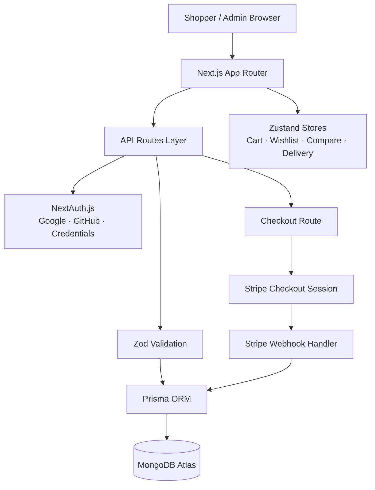
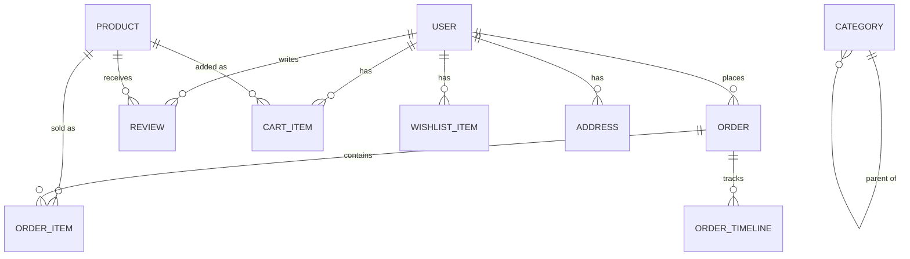

<div align="center">

# Amazon India — Modern Commerce Platform

### A production-grade full-stack e-commerce platform inspired by Amazon India

Secure authentication · Stripe-powered checkout · Role-based admin console · Persisted cart & wishlist state · MongoDB via Prisma

[](https://nextjs.org/)
[](https://react.dev/)
[](https://www.typescriptlang.org/)
[](https://tailwindcss.com/)
[](https://www.prisma.io/)
[](https://www.mongodb.com/atlas)
[](https://stripe.com/)
[](https://next-auth.js.org/)
[](#license)

[Live Demo](https://amazon-clone-nextjs-pi.vercel.app/) · [Report an Issue](https://github.com/tanmaytyagii/amazon-clone-nextjs/issues) · [Request a Feature](https://github.com/tanmaytyagii/amazon-clone-nextjs/issues)

</div>

---

## Overview

**Amazon India** is a full-stack e-commerce application that reproduces the core shopping experience of a modern marketplace: product discovery, cart and wishlist management, authenticated checkout, Stripe payment processing, order lifecycle tracking, and an admin console for catalog and order operations.

The project is built on the Next.js App Router with a typed, server-first architecture — API routes handle validation, authorization, and persistence, while the client layer uses Zustand for fast, persisted UI state (cart, wishlist, compare list, delivery preferences) without round-tripping to the server for every interaction.

**What it demonstrates:**

- A relational-style data model (users, products, orders, reviews, addresses, coupons, payments) implemented on a document database (MongoDB) via Prisma, including referential relations and enums for order/payment state machines.
- A real checkout pipeline: server-side order creation → Stripe Checkout Session → signature-verified webhook → order status transition, rather than a client-only "fake payment" flow.
- Credential and OAuth authentication in the same NextAuth configuration, with JWT sessions, password hashing, and role-based route protection enforced both in middleware and inside individual API handlers.
- A seed script that provisions a working demo environment (admin account, customer account, catalog, and a sample order) in one command.

This is not a static UI mockup — every checkout, cart, review, wishlist, and admin action reads from and writes to a real database through typed, validated API routes.

---

## Visual Showcase

| Home & Product Discovery | Product Detail |
|---|---|
|  |  |

| Search & Filtering | Admin Overview |
|---|---|
|  |  |

> Screenshots are served directly from `public/screenshots/`. Cart, checkout, and per-user dashboard views are best explored by running the app locally with the seed data described below.

---

## Feature Set

### Customer Experience

| Feature | Engineering Detail |
|---|---|
| **Storefront & category browsing** | Category-driven product feed with hero campaign slides, rendered server-first for fast initial paint. |
| **Search with live suggestions** | Debounced query hook (`hooks/use-debounce.ts`) backed by a dedicated `/api/search/suggestions` endpoint, with per-user search history persisted via `SearchHistory`. |
| **Product comparison** | Client-side compare list (`compare-store.ts`, Zustand) lets shoppers stage multiple products for a side-by-side `/compare` view. |
| **Cart with save-for-later** | Persisted cart store supports quantity caps, moving items between cart/wishlist/saved-for-later without a page reload. |
| **Wishlist** | Server-backed `WishlistItem` model plus an optimistic client store for instant UI feedback. |
| **Ratings & reviews** | Reviews carry `verifiedPurchase`, `helpfulVotes`, and an optional seller `reply`, matching real marketplace review semantics rather than a flat comment list. |
| **Coupons** | Server-validated coupon engine (`/api/coupons/validate`) enforcing minimum order value and percentage/flat discount rules. |
| **Delivery estimation** | Pincode-aware delivery-date calculation with faster ETAs for Prime members (`lib/delivery.ts`). |
| **Prime membership** | Dedicated `/prime` and `/dashboard/prime` surfaces backed by `isPrime` / `primeExpiresAt` fields on the user model, driving free shipping and delivery-speed logic. |
| **Shopping assistant** | An in-app chat widget (`/api/ai/chat`) that resolves order-tracking, Prime, return, and comparison intents and surfaces matching catalog products — a deterministic, rules-based assistant rather than a hosted LLM integration. |

### Authentication & Security

- **NextAuth.js** configured with Google OAuth, GitHub OAuth, and a Credentials provider backed by `bcryptjs` password hashing, all sharing one Prisma-adapted session store.
- **JWT sessions** enriched with the user's database role on first sign-in, avoiding a database lookup on every request.
- **Route-level protection** via `middleware.ts`, gating `/checkout` and every `/dashboard/*` route behind an authenticated session.
- **API-level authorization**, independent of the UI: every admin route re-verifies `session.user.role === "ADMIN"` server-side before touching the database.
- **Input validation with Zod** on registration, checkout, and product-management payloads, rejecting malformed requests before they reach Prisma.

### Admin Platform

- `/admin` — operational overview.
- `/admin/products` — catalog CRUD backed by `productSchema`-validated API routes.
- `/admin/orders` — order status and fulfillment management.
- `/admin/users` — user account and role administration.

All admin API routes (`app/api/admin/**`) implement a shared `requireAdmin()` guard that rejects any request from a non-admin session with a `403`, regardless of what the client sends.

### Payment System

- **Stripe Checkout Sessions** created server-side, with line items priced in INR (paise) directly from the authoritative product price — never trusted from the client.
- **Order-first flow**: an `Order` and its `OrderItem`s are persisted *before* redirecting to Stripe, so incomplete or abandoned checkouts remain auditable.
- **Signature-verified webhooks** (`/api/stripe/webhook`) confirm `checkout.session.completed` events and transition the order to `PAID`, storing the Stripe PaymentIntent ID for reconciliation.
- **Order lifecycle modeling**: `OrderStatus` spans `PENDING → PAID → PROCESSING → PACKED → SHIPPED → OUT_FOR_DELIVERY → DELIVERED`, plus `CANCELLED` / `RETURNED`, with a companion `OrderTimeline` model for status history.
- **Automatic tax and shipping**: 18% GST-style tax calculation and free-shipping thresholds (or Prime override) computed consistently in both cart and checkout.
- Schema-level support for multi-provider payments (`STRIPE`, `RAZORPAY`, `PAYPAL`, `COD`), with Stripe as the implemented provider.

---

## System Architecture

**Frontend** — Next.js App Router with server components for data-heavy pages (home, product listing, product detail) and client components scoped to interactive islands (cart drawer, filters, chat widget). Zustand handles cross-page client state — cart, wishlist, compare list, delivery preferences, search history — with `persist` middleware so state survives a refresh without a server round trip.

**Backend** — Colocated API routes under `app/api/**` handle authentication, catalog access, cart/wishlist mutations, checkout orchestration, coupon validation, delivery checks, and the full admin surface. Every write route validates its payload with Zod before it reaches Prisma.

**Database** — Prisma ORM against MongoDB, modeling 15+ collections (users, accounts, sessions, products, categories, reviews, addresses, cart items, wishlist items, saved-for-later items, coupons, orders, order items, order timeline, payments, notifications, search history) with explicit relations and enums for role and status fields.

**External services** — Stripe for payment processing and webhook-driven order confirmation; Google and GitHub as OAuth identity providers through NextAuth.



---

## Technology Stack

| Category | Technologies | Purpose |
|---|---|---|
| **Frontend** | Next.js 15 (App Router), React 19, TypeScript, Tailwind CSS 3 | Server-first rendering, typed components, utility-first styling |
| **UI & Interaction** | Framer Motion, lucide-react, next-themes, sonner, react-spinners | Animation, iconography, light/dark theming, toast notifications, loading states |
| **State Management** | Zustand (with `persist` middleware) | Client-side cart, wishlist, compare list, delivery, and search-history stores |
| **Backend** | Next.js Route Handlers (API Routes) | Authentication, catalog, cart, checkout, coupon, delivery, and admin endpoints |
| **Validation** | Zod | Schema validation for auth, cart, checkout, and product-management payloads |
| **Authentication** | NextAuth.js 4, `@next-auth/prisma-adapter`, bcryptjs | OAuth (Google, GitHub) + credentials auth with hashed passwords and JWT sessions |
| **Database & ORM** | MongoDB Atlas, Prisma 6 | Document persistence with a typed, relational-style schema |
| **Payments** | Stripe (Checkout Sessions, Webhooks, `@stripe/stripe-js`) | Hosted checkout, payment confirmation, order reconciliation |
| **Tooling** | ESLint, Prettier, TypeScript compiler, tsx | Linting, formatting, type-checking, and running the seed script |

---

## Project Structure

```
amazon-clone-nextjs/
├── app/
│   ├── api/                 # Route handlers: auth, products, cart, checkout,
│   │                         # orders, wishlist, coupons, delivery, search, admin, ai
│   ├── admin/                # Admin console: overview, products, orders, users
│   ├── dashboard/             # Authenticated user area: profile, addresses,
│   │                          # orders, wishlist, payments, notifications, security, prime
│   ├── products/[slug]/      # Product detail pages
│   ├── cart/, checkout/      # Cart and checkout flow (checkout/success on completion)
│   ├── search/, compare/     # Search results and product comparison
│   ├── login/, signup/, forgot-password/
│   ├── prime/                 # Prime membership landing page
│   └── layout.tsx, page.tsx   # Root layout and homepage
│
├── components/
│   ├── admin/                 # Admin console UI (product/order/user tables & forms)
│   ├── ai/                    # Shopping-assistant chat widget
│   ├── auth/                  # Sign-in / sign-up forms
│   ├── cart/                  # Cart drawer, line items, coupon input
│   ├── dashboard/              # User-account UI
│   ├── home/                  # Hero, category grid, product rails
│   ├── layout/                # Header, navigation, footer
│   ├── product/                # Product card, gallery, reviews, compare tray
│   ├── providers/              # Zustand stores + app-level context providers
│   └── ui/                    # Shared primitives (buttons, inputs, dialogs, etc.)
│
├── hooks/                     # use-debounce, use-local-storage, use-search-suggestions
│
├── lib/
│   ├── auth.ts                 # NextAuth configuration
│   ├── prisma.ts               # Prisma client singleton
│   ├── stripe.ts               # Stripe client singleton
│   ├── data.ts                 # Seed/demo catalog and homepage content
│   ├── products.ts             # Catalog lookup helpers
│   ├── delivery.ts             # Tax, shipping, coupon, and ETA calculations
│   ├── validators.ts           # Zod schemas
│   └── utils.ts, design-tokens.ts, recentlyViewed.ts
│
├── prisma/
│   └── schema.prisma           # Full data model (User, Product, Order, Payment, etc.)
│
├── scripts/
│   └── seed.ts                 # Seeds an admin, a customer, the catalog, and a sample order
│
├── types/                      # Shared TypeScript types, NextAuth session augmentation
├── middleware.ts                # Route protection for /checkout and /dashboard/*
└── public/screenshots/          # README screenshots
```

---

## Getting Started

### Prerequisites

- **Node.js** 18.18+ (Next.js 15 / React 19 baseline)
- **npm** 9+
- A **MongoDB** database (local `mongod` or a free [MongoDB Atlas](https://www.mongodb.com/atlas) cluster)
- A **Stripe** account (test-mode keys are sufficient for local development)
- (Optional) **Google** and **GitHub** OAuth apps for social login

### Installation

```bash
git clone https://github.com/tanmaytyagii/amazon-clone-nextjs.git
cd amazon-clone-nextjs
npm install
```

### Environment Setup

Create a `.env` file at the project root using `.env.example` as a reference:

```bash
cp .env.example .env
```

Fill in the values described in [Environment Variables](#environment-variables) below.

### Database Setup

```bash
npm run prisma:generate   # Generate the Prisma client
npm run db:push           # Push the schema to your MongoDB database
npm run db:seed           # Seed an admin user, a demo customer, the catalog, and a sample order
```

Seeded accounts (from `scripts/seed.ts`):

| Role | Email | Password |
|---|---|---|
| Admin | `admin@example.com` | `Admin@123` |
| Customer | `customer@example.com` | `User@123` |

### Running the Application

```bash
npm run dev        # Start the development server at http://localhost:3000
npm run build       # Production build (runs `prisma generate` first)
npm run start        # Serve the production build
npm run lint          # ESLint
npm run typecheck      # TypeScript, no emit
```

---

## Environment Variables

| Variable | Required | Purpose |
|---|---|---|
| `DATABASE_URL` | Yes | MongoDB connection string used by Prisma |
| `NEXTAUTH_URL` | Yes | Base URL NextAuth uses for callbacks (e.g. `http://localhost:3000`) |
| `NEXTAUTH_SECRET` | Yes | Secret used to sign and encrypt NextAuth JWTs |
| `GOOGLE_CLIENT_ID` / `GOOGLE_CLIENT_SECRET` | Optional | Enables "Sign in with Google" |
| `GITHUB_CLIENT_ID` / `GITHUB_CLIENT_SECRET` | Optional | Enables "Sign in with GitHub" |
| `STRIPE_SECRET_KEY` | Yes (for checkout) | Server-side Stripe API key used to create Checkout Sessions |
| `NEXT_PUBLIC_STRIPE_PUBLISHABLE_KEY` | Yes (for checkout) | Client-side Stripe publishable key |
| `STRIPE_WEBHOOK_SECRET` | Yes (for order confirmation) | Verifies the authenticity of incoming Stripe webhook events |
| `NEXT_PUBLIC_APP_URL` | Yes | Absolute app URL used to build Stripe success/cancel redirect links |

> Without OAuth credentials, the app falls back to placeholder values and email/password authentication continues to work.

---

## API Reference

| Endpoint | Method | Description | Auth |
|---|---|---|---|
| `/api/auth/register` | POST | Create a new credentials-based account | Public |
| `/api/auth/[...nextauth]` | GET/POST | NextAuth sign-in, callback, and session routes | Public |
| `/api/products` | GET | List/filter the product catalog | Public |
| `/api/products/[id]` | GET | Fetch a single product | Public |
| `/api/search/suggestions` | GET | Live search suggestions | Public |
| `/api/delivery/check` | GET | Pincode serviceability and ETA | Public |
| `/api/coupons/validate` | POST | Validate a coupon code against order subtotal | Session |
| `/api/cart` | GET/POST/PATCH/DELETE | Read and mutate the signed-in user's cart | Session |
| `/api/wishlist` | GET/POST/DELETE | Read and mutate the signed-in user's wishlist | Session |
| `/api/checkout` | POST | Create an order and a Stripe Checkout Session | Session |
| `/api/orders` | GET | List the signed-in user's orders | Session |
| `/api/stripe/webhook` | POST | Stripe webhook receiver; confirms payment and updates order status | Stripe signature |
| `/api/ai/chat` | POST | Rules-based shopping assistant (FAQ + catalog matching) | Public |
| `/api/ai/recommendations` | GET | Trending / deals / Prime / personalized product surfacing | Public |
| `/api/admin/products` | GET/POST | List and create catalog products | Admin |
| `/api/admin/products/[id]` | PATCH/DELETE | Update or remove a product | Admin |
| `/api/admin/orders` | GET | List all orders | Admin |
| `/api/admin/orders/[id]` | PATCH | Update order status | Admin |
| `/api/admin/users` | GET | List all users | Admin |
| `/api/admin/users/[id]` | PATCH | Update a user's role or ban status | Admin |

---

## Database Design

The schema is defined in `prisma/schema.prisma` and deployed to MongoDB. Core entities:

- **User** — authentication identity, role (`USER` / `ADMIN`), Prime status, and relations to every downstream entity (orders, reviews, cart, wishlist, addresses, notifications, payments, search history).
- **Product** — catalog entry with pricing (`price`, `mrp`, `discount`), inventory (`stock`), merchandising flags (`isFeatured`, `isSponsored`, `isFlashDeal`), and free-form `specifications` (JSON).
- **Order / OrderItem / OrderTimeline** — an order snapshot with denormalized item data (title, image, price at time of purchase) plus a status-change timeline, decoupled from the live product record.
- **Review** — linked to both `User` and `Product`, with verified-purchase flagging and a seller `reply`.
- **Category** — self-referential tree (`parent` / `children`) for nested category navigation.
- **Coupon / Payment / Notification / SearchHistory** — supporting entities for promotions, payment auditing, in-app notifications, and personalization signals.



---

## Application Flow

**Shopping flow**
Browse or search catalog → view product detail → add to cart / wishlist / compare → review cart (coupons, saved items) → sign in if needed → checkout.

**Checkout flow**
Authenticated request hits `/api/checkout` → server prices the order from the database (never the client) → `Order` + `OrderItem`s persisted as `PENDING` → Stripe Checkout Session created → user redirected to Stripe → on success, Stripe fires `checkout.session.completed` → webhook verifies the signature and marks the order `PAID`.

**Authentication flow**
User signs in via Google, GitHub, or email/password → NextAuth issues a JWT session enriched with the user's role → `middleware.ts` gates `/checkout` and `/dashboard/*` on session presence → admin API routes independently re-check `role === "ADMIN"`.

**Admin workflow**
Admin signs in → `/admin` surfaces orders, products, and users → product/order/user mutations go through Zod-validated, role-guarded API routes → changes are immediately reflected in the storefront and customer dashboards.

---

## Engineering Decisions

**Why Next.js App Router?** Colocating server components, client islands, and API route handlers in one project removes the need for a separate backend service for a project of this scope, while still keeping a clear boundary between server-only logic (Stripe secret key, Prisma access) and client bundles.

**Why Prisma over a raw MongoDB driver?** A typed schema and generated client catch shape mismatches (e.g., a checkout payload missing a required address field) at compile time rather than at runtime in production, and the same schema documents the entire data model in one file.

**Why MongoDB?** The catalog and order documents are naturally hierarchical (an order embeds shipping details, references line items, and accumulates a timeline) and benefit from MongoDB's flexible document shape, particularly for the `specifications: Json?` field on `Product`, without giving up relational integrity — Prisma still enforces typed relations on top of it.

**Why Zustand over Redux/Context for client state?** Cart, wishlist, compare, and delivery preferences are read and written far more often on the client than they need to touch the server. Zustand's minimal API and `persist` middleware keep that state fast and durable across reloads without Redux's boilerplate or the re-render cost of a naive Context implementation.

**Why validate with Zod at the API boundary?** Every write route (`checkout`, `cart`, `products`, `register`) parses its input with a Zod schema before it reaches Prisma, so malformed or malicious payloads are rejected with a clear error instead of causing a downstream database error.

---

## Development Workflow

```bash
npm run dev         # Local development with hot reload
npm run lint          # ESLint (next/core-web-vitals + TypeScript rules)
npm run typecheck      # Full TypeScript project check, no output emitted
npm run prisma:studio   # Prisma Studio — inspect and edit data visually
npm run build           # Production build (runs prisma generate first)
```

Recommended before opening a pull request: `npm run lint && npm run typecheck && npm run build`.

---

## Deployment Guide

1. **Database** — Provision a MongoDB Atlas cluster, whitelist your deployment platform's egress IPs (or allow all for serverless platforms), and set `DATABASE_URL`.
2. **Stripe** — Switch to live-mode keys for `STRIPE_SECRET_KEY` / `NEXT_PUBLIC_STRIPE_PUBLISHABLE_KEY`, and register a production webhook endpoint (`/api/stripe/webhook`) in the Stripe dashboard to obtain `STRIPE_WEBHOOK_SECRET`.
3. **Auth** — Update the OAuth redirect URIs registered with Google/GitHub to match the production domain, and set `NEXTAUTH_URL` / `NEXT_PUBLIC_APP_URL` accordingly.
4. **Hosting** — Deploy to [Vercel](https://vercel.com/) (first-class Next.js support, zero-config App Router builds) or any Node-compatible platform that can run `npm run build && npm run start`.
5. **Post-deploy** — Run `npm run db:push` (and `db:seed` if you want demo data) against the production database before first traffic.

---

## Roadmap

- AI-assisted product recommendations backed by a hosted LLM, replacing the current rules-based assistant
- Personalized "for you" ranking based on browsing and purchase history
- Advanced analytics dashboard for admins (conversion funnels, cohort retention)
- Inventory and low-stock alerting
- Full-text/faceted search optimization (e.g., a dedicated search index)
- Multi-warehouse fulfillment and split shipments
- Automated test coverage (unit + end-to-end) and CI pipeline

---

## Contributing

Contributions are welcome.

1. Fork the repository
2. Create a feature branch: `git checkout -b feature/your-feature-name`
3. Commit your changes with clear, descriptive messages
4. Run `npm run lint && npm run typecheck` before pushing
5. Open a pull request describing the change and its motivation

Please open an issue first for significant changes so the approach can be discussed before implementation.

---

## License

This project does not currently ship a `LICENSE` file. Until one is added, all rights are reserved by the author; if you intend to reuse this code, please open an issue or contact the maintainer to clarify terms (an MIT license is recommended for open-source use).

---

## Author

**Tanmay Tyagi**

[](https://github.com/tanmaytyagii)
[](https://linkedin.com/in/tyagitanmay/)

</div>
