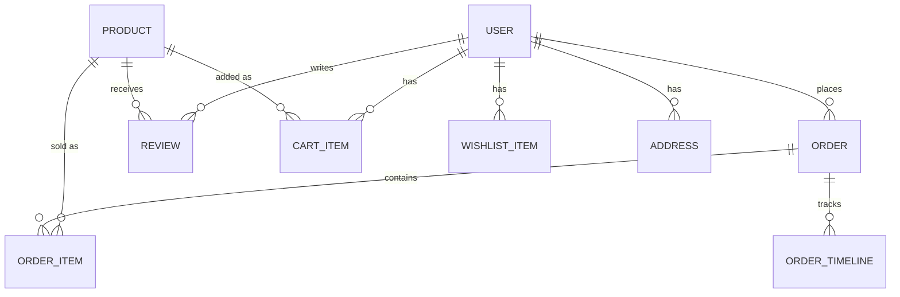

<div align="center">

# Amazon India Clone

### An educational full-stack Amazon.in-inspired e-commerce clone built with Next.js

[](https://nextjs.org/)
[](https://react.dev/)
[](https://www.typescriptlang.org/)
[](https://tailwindcss.com/)
[](https://www.prisma.io/)
[](https://www.mongodb.com/atlas)
[](https://stripe.com/)
[](https://next-auth.js.org/)
[](LICENSE)

[Live Demo](https://amazon-clone-nextjs-pi.vercel.app/) · [Report an Issue](https://github.com/tanmaytyagii/amazon-clone-nextjs/issues) · [Request a Feature](https://github.com/tanmaytyagii/amazon-clone-nextjs/issues)

</div>

---

## ⚠️ Educational Project Disclaimer

This is an **independent, non-commercial portfolio project** built to demonstrate full-stack engineering skills. It recreates the *look and core shopping flow* of Amazon.in for learning purposes only.

- **Not affiliated with, endorsed by, or sponsored by Amazon.com, Inc.** or any of its affiliates.
- "Amazon" and related marks are trademarks of Amazon.com, Inc.; they are referenced here solely to describe the design this project is styled after.
- All product listings, brand names, prices, and reviews in the seed catalog are **fictional/demo data** for illustration only — no real inventory, sellers, or transactions exist.
- Payments run through **Stripe test mode**; no real payment processing is intended or supported.

---

## Overview

**Amazon India Clone** is a full-stack e-commerce application that reproduces the core shopping experience of a modern marketplace: product discovery, cart and wishlist management, authenticated checkout, Stripe payment processing, order lifecycle tracking, customer reviews, and an admin console for catalog and order operations.

The project is built on the Next.js App Router with a typed, server-first architecture — API routes handle validation, authorization, and persistence, while the client layer uses Zustand for fast, persisted UI state (cart, wishlist, compare list, delivery preferences) without round-tripping to the server for every interaction.

**What it demonstrates:**

- A relational-style data model (users, products, orders, reviews, addresses, coupons, payments) implemented on a document database (MongoDB) via Prisma, including referential relations and enums for order/payment state machines.
- A real checkout pipeline: server-side order creation → Stripe Checkout Session → signature-verified webhook → order status transition, rather than a client-only "fake payment" flow.
- Credential and OAuth authentication in the same NextAuth configuration, with JWT sessions, password hashing, and role-based route protection enforced both in middleware and inside individual API handlers.
- A 189-product demo catalog spanning 22 categories, backed by MongoDB with an automatic static fallback so the storefront still renders if the database is unreachable.
- A seed script that provisions a working demo environment (admin account, customer account, catalog, and a sample order) in one command.

This is not a static UI mockup — every checkout, cart, review, wishlist, address, and admin action reads from and writes to a real database through typed, validated API routes.

---

## Screenshots

> Add your own screenshots to `public/screenshots/` and reference them here — the images below were captured from an earlier version of the UI and may not reflect the current catalog, header, or layout. Regenerate them after running the app locally for an accurate preview.

| Home & Product Discovery | Product Detail |
|---|---|
|  |  |

| Search & Filtering | Admin Overview |
|---|---|
|  |  |

---

## Features

### Product Catalog & Discovery

| Feature | Detail |
|---|---|
| **Storefront** | 189 demo products across 22 categories (mobiles, laptops, fashion, home & kitchen, grocery, gaming, and more), rendered server-first for fast initial paint. |
| **Search** | Full-text search across title, brand, and tags, backed by MongoDB with sort (price, rating, discount, newest) and pagination. |
| **Filtering** | Left-hand filter sidebar for category and customer rating, matching Amazon.in's search results layout. |
| **Live search suggestions** | Debounced typeahead (`hooks/use-search-suggestions.ts`) backed by `/api/search/suggestions`, with per-user search history. |
| **Product comparison** | Client-side compare list (Zustand) lets shoppers stage multiple products for a side-by-side `/compare` view. |
| **Recently viewed** | LocalStorage-backed "recently viewed" rail on both the homepage and product pages. |
| **Database-backed catalog** | Every storefront page (home, search, product detail) reads from MongoDB via Prisma; a static fallback catalog keeps the UI usable if the database is briefly unavailable. |

### Cart & Wishlist

- Zustand-persisted cart and wishlist so guest shoppers keep their state across a refresh with no account required.
- On sign-in, the guest cart/wishlist is automatically merged into the signed-in user's database-backed cart (`CartItem`) and wishlist (`WishlistItem`), so nothing is lost.
- Save-for-later, quantity controls, and coupon application on the cart page.
- Cart clears automatically after a successful order.

### Checkout & Payments

- **Stripe Checkout Sessions** created server-side, with line items priced in INR directly from the authoritative database product price — never trusted from the client.
- **Order-first flow**: an `Order` and its `OrderItem`s are persisted *before* redirecting to Stripe, so incomplete or abandoned checkouts remain auditable.
- **Signature-verified webhook** (`/api/stripe/webhook`) confirms `checkout.session.completed` events and transitions the order to `PAID`.
- **Saved addresses**: full CRUD for shipping addresses, selectable directly from the checkout flow.
- **Order lifecycle modeling**: `OrderStatus` spans `PENDING → PAID → PROCESSING → PACKED → SHIPPED → OUT_FOR_DELIVERY → DELIVERED`, plus `CANCELLED` / `RETURNED`.
- Automatic 18% GST-style tax and free-shipping threshold calculation, consistent across cart and checkout.

### Orders & Reviews

- Real order history (`/dashboard/orders`) pulled from the database, with a proper empty state for new accounts — no placeholder/demo orders are ever fabricated.
- Authenticated users can submit a star rating, title, and comment on any product; reviews are flagged `verifiedPurchase` automatically when the reviewer has a paid order containing that product.
- Product rating and review count recalculate from real review data whenever a new review is submitted.

### Authentication & Security

- **NextAuth.js** configured with Google OAuth, GitHub OAuth, and a Credentials provider backed by `bcryptjs` password hashing, all sharing one Prisma-adapted session store.
- **JWT sessions** enriched with the user's database role on first sign-in.
- **Route-level protection** via `middleware.ts`, gating `/checkout`, every `/dashboard/*` route, and every `/admin/*` route behind an authenticated (and, for admin, role-checked) session.
- **API-level authorization**, independent of the UI: every admin route re-verifies `session.user.role === "ADMIN"` server-side before touching the database.
- **Input validation with Zod** on registration, checkout, cart, review, address, and product-management payloads.

### AI Shopping Assistant

An in-app chat widget (`/api/ai/chat`) that resolves order-tracking, Prime, return, and comparison questions and surfaces matching catalog products. It is a **deterministic, rules-based assistant** (keyword/intent matching against the real catalog) rather than a hosted LLM integration — this is called out explicitly so the feature isn't mischaracterized.

### Admin Console

- `/admin` — overview with **real database aggregates**: revenue, order count, user count, average order value, a 7-day sales chart, and top-selling products.
- `/admin/products` — catalog CRUD backed by Zod-validated API routes; changes are immediately reflected on the live storefront.
- `/admin/orders` — order status management against real orders.
- `/admin/users` — user account and role administration.

All admin API routes (`app/api/admin/**`) implement a shared admin guard that rejects any request from a non-admin session with a `403`, regardless of what the client sends, and `/admin/*` pages themselves are gated server-side in `middleware.ts`.

### Responsive UI

Amazon.in-styled interface (navy/gold header, category strip, product-card density, buy-box layout) built mobile-first with Tailwind CSS, verified across mobile, tablet, and desktop breakpoints, with light/dark theme support via `next-themes`.

---

## Tech Stack

| Category | Technologies | Purpose |
|---|---|---|
| **Frontend** | Next.js 15 (App Router), React 19, TypeScript, Tailwind CSS 3 | Server-first rendering, typed components, utility-first styling |
| **UI & Interaction** | Framer Motion, lucide-react, next-themes, sonner | Animation, iconography, light/dark theming, toast notifications |
| **State Management** | Zustand (with `persist` middleware) | Client-side cart, wishlist, compare list, delivery, and search-history stores |
| **Backend** | Next.js Route Handlers (API Routes) | Authentication, catalog, cart, checkout, coupon, delivery, review, address, and admin endpoints |
| **Validation** | Zod | Schema validation at every write-route boundary |
| **Authentication** | NextAuth.js 4, `@next-auth/prisma-adapter`, bcryptjs | OAuth (Google, GitHub) + credentials auth with hashed passwords and JWT sessions |
| **Database & ORM** | MongoDB Atlas, Prisma 6 | Document persistence with a typed, relational-style schema |
| **Payments** | Stripe (Checkout Sessions, Webhooks, `@stripe/stripe-js`) | Hosted checkout, payment confirmation, order reconciliation |
| **Tooling** | ESLint, Prettier, TypeScript compiler, tsx | Linting, formatting, type-checking, and running the seed script |

---

## Project Structure

```
amazon-clone-nextjs/
├── app/
│   ├── api/                  # Route handlers: auth, products, cart, checkout, orders,
│   │                         #   wishlist, reviews, addresses, coupons, delivery, search, admin, ai
│   ├── admin/                 # Admin console: overview, products, orders, users
│   ├── dashboard/              # Authenticated user area: profile, addresses, orders,
│   │                          #   wishlist, payments, notifications, security, prime
│   ├── products/[slug]/       # Product detail pages
│   ├── cart/, checkout/       # Cart and checkout flow (checkout/success on completion)
│   ├── search/, compare/      # Search results and product comparison
│   ├── login/, signup/, forgot-password/
│   ├── prime/                  # Prime membership landing page
│   ├── icon.svg, manifest.ts   # Favicon and web app manifest
│   ├── not-found.tsx, error.tsx
│   └── layout.tsx, page.tsx    # Root layout and homepage
│
├── components/
│   ├── admin/                  # Admin console UI (product/order/user tables & forms)
│   ├── ai/                     # Shopping-assistant chat widget
│   ├── auth/                   # Sign-in / sign-up forms
│   ├── cart/                   # Cart view, checkout form
│   ├── dashboard/               # User-account UI, address manager
│   ├── home/                   # Hero, category grid, product rails
│   ├── layout/                 # Navbar, search bar, footer
│   ├── product/                 # Product card, gallery, reviews, search sidebar
│   ├── providers/               # Zustand stores + app-level context providers
│   └── ui/                     # Shared primitives (buttons, badges, ratings, etc.)
│
├── hooks/                      # use-debounce, use-local-storage, use-search-suggestions
│
├── lib/
│   ├── auth.ts                  # NextAuth configuration
│   ├── prisma.ts                # Prisma client singleton
│   ├── stripe.ts                # Stripe client singleton
│   ├── data.ts                  # Seed/demo catalog (189 products) and homepage content
│   ├── products.ts              # Database-backed catalog queries with static fallback
│   ├── reviews.ts                # Review queries
│   ├── delivery.ts               # Tax, shipping, coupon, and ETA calculations
│   ├── validators.ts             # Zod schemas
│   └── utils.ts, serialize-product.ts, db-fallback.ts, recentlyViewed.ts
│
├── prisma/
│   └── schema.prisma             # Full data model (User, Product, Order, Payment, etc.)
│
├── scripts/
│   └── seed.ts                   # Seeds an admin, a customer, the catalog, and a sample order
│
├── types/                        # Shared TypeScript types, NextAuth session augmentation
├── middleware.ts                  # Route protection for /checkout, /dashboard/*, /admin/*
└── public/products/, public/hero/ # Product and hero imagery
```

---

## Getting Started

### Prerequisites

- **Node.js** 18.18+ (Next.js 15 / React 19 baseline)
- **npm** 9+
- A **MongoDB** database (local `mongod`/Docker, or a free [MongoDB Atlas](https://www.mongodb.com/atlas) cluster). Prisma's MongoDB connector requires the database to be configured as a replica set (Atlas clusters already are).
- A **Stripe** account (test-mode keys are sufficient for local development)
- (Optional) **Google** and **GitHub** OAuth apps for social login

### Installation

```bash
git clone https://github.com/tanmaytyagii/amazon-clone-nextjs.git
cd amazon-clone-nextjs
npm install
```

### Environment Setup

Copy `.env.example` to `.env.local` and fill in real values:

```bash
cp .env.example .env.local
```

> The Prisma CLI (`prisma generate`, `db push`) reads a plain `.env` file rather than `.env.local` — that's a Next.js-only convention. If you run Prisma CLI commands directly, also copy your `DATABASE_URL` into a `.env` file. Both files are git-ignored.

See [Environment Variables](#environment-variables) below for what each value does.

### Database Setup

```bash
npm run prisma:generate   # Generate the Prisma client
npm run db:push           # Push the schema to your MongoDB database
npm run db:seed           # Seed an admin user, a demo customer, the catalog, and a sample order
```

Seeded accounts (from `scripts/seed.ts`):

| Role | Email | Password |
|---|---|---|
| Admin | `admin@example.com` | `Admin@123` |
| Customer | `customer@example.com` | `User@123` |

> Change or remove these before deploying anywhere publicly reachable.

### Running the Application

```bash
npm run dev         # Start the development server at http://localhost:3000
npm run build         # Production build (runs `prisma generate` first)
npm run start          # Serve the production build
```

---

## npm Scripts

| Script | Description |
|---|---|
| `npm run dev` | Start the local dev server with hot reload |
| `npm run build` | Generate the Prisma client and create a production build |
| `npm run start` | Serve the production build |
| `npm run lint` | Run ESLint |
| `npm run typecheck` | Run the TypeScript compiler with no emit |
| `npm run prisma:generate` | Regenerate the Prisma client |
| `npm run prisma:studio` | Open Prisma Studio to inspect/edit data visually |
| `npm run db:push` | Push `prisma/schema.prisma` to the connected database |
| `npm run db:seed` | Run the seed script (admin, demo customer, catalog, sample order) |

Recommended before opening a pull request: `npm run lint && npm run typecheck && npm run build`.

---

## Environment Variables

| Variable | Required | Purpose |
|---|---|---|
| `DATABASE_URL` | Yes | MongoDB connection string used by Prisma |
| `NEXTAUTH_URL` | Yes | Base URL NextAuth uses for callbacks (e.g. `http://localhost:3000`) |
| `NEXTAUTH_SECRET` | Yes | Secret used to sign and encrypt NextAuth JWTs |
| `GOOGLE_CLIENT_ID` / `GOOGLE_CLIENT_SECRET` | Optional | Enables "Sign in with Google" |
| `GITHUB_CLIENT_ID` / `GITHUB_CLIENT_SECRET` | Optional | Enables "Sign in with GitHub" |
| `STRIPE_SECRET_KEY` | Yes (for checkout) | Server-side Stripe API key used to create Checkout Sessions |
| `NEXT_PUBLIC_STRIPE_PUBLISHABLE_KEY` | Yes (for checkout) | Client-side Stripe publishable key |
| `STRIPE_WEBHOOK_SECRET` | Yes (for order confirmation) | Verifies the authenticity of incoming Stripe webhook events |
| `NEXT_PUBLIC_APP_URL` | Yes | Absolute app URL used for metadata and Stripe redirect links |

> Without OAuth credentials, the app falls back to placeholder values and email/password authentication continues to work. **Never commit real values** — `.env` and `.env.local` are git-ignored; only `.env.example` (placeholders only) is tracked.

---

## API Reference

| Endpoint | Method | Description | Auth |
|---|---|---|---|
| `/api/auth/register` | POST | Create a new credentials-based account | Public |
| `/api/auth/[...nextauth]` | GET/POST | NextAuth sign-in, callback, and session routes | Public |
| `/api/products` | GET | List/filter the product catalog | Public |
| `/api/products/[id]` | GET | Fetch a single product with reviews | Public |
| `/api/search/suggestions` | GET | Live search suggestions | Public |
| `/api/delivery/check` | GET | Pincode serviceability and ETA | Public |
| `/api/coupons/validate` | POST | Validate a coupon code against order subtotal | Session |
| `/api/cart` | GET/POST/DELETE | Read and mutate the signed-in user's cart | Session |
| `/api/wishlist` | GET/POST/DELETE | Read and mutate the signed-in user's wishlist | Session |
| `/api/addresses` | GET/POST | List and add saved shipping addresses | Session |
| `/api/addresses/[id]` | PATCH/DELETE | Update or remove a saved address | Session |
| `/api/reviews` | GET/POST | Read/submit product reviews | Public (GET) / Session (POST) |
| `/api/checkout` | POST | Create an order and a Stripe Checkout Session | Session |
| `/api/orders` | GET | List the signed-in user's orders | Session |
| `/api/stripe/webhook` | POST | Stripe webhook receiver; confirms payment and updates order status | Stripe signature |
| `/api/ai/chat` | POST | Rules-based shopping assistant (FAQ + catalog matching) | Public |
| `/api/ai/recommendations` | GET | Trending / deals / Prime product surfacing | Public |
| `/api/admin/products` | GET/POST | List and create catalog products | Admin |
| `/api/admin/products/[id]` | PATCH/DELETE | Update or remove a product | Admin |
| `/api/admin/orders` | GET | List all orders | Admin |
| `/api/admin/orders/[id]` | PATCH | Update order status | Admin |
| `/api/admin/users` | GET | List all users | Admin |
| `/api/admin/users/[id]` | PATCH | Update a user's role | Admin |

---

## Database Design

The schema is defined in `prisma/schema.prisma` and deployed to MongoDB. Core entities:

- **User** — authentication identity, role (`USER` / `ADMIN`), Prime status, and relations to every downstream entity (orders, reviews, cart, wishlist, addresses, payments, search history).
- **Product** — catalog entry with pricing (`price`, `mrp`, `discount`), inventory (`stock`), merchandising flags (`isFeatured`, `isSponsored`, `isFlashDeal`), and free-form `specifications` (JSON). Category is a plain string field on `Product`, not a relation.
- **Order / OrderItem / OrderTimeline** — an order snapshot with denormalized item data (title, image, price at time of purchase) plus a status-change timeline, decoupled from the live product record.
- **Review** — linked to both `User` and `Product`, with verified-purchase flagging computed from real order history.
- **Address** — saved shipping addresses per user, with a default-address flag.
- **Coupon / Payment / SearchHistory** — supporting entities for promotions, payment auditing, and personalization signals.



---

## Deployment Guide

1. **Database** — Provision a MongoDB Atlas cluster (already a replica set), whitelist your deployment platform's egress IPs (or allow all for serverless platforms), and set `DATABASE_URL`.
2. **Stripe** — Switch to live-mode keys for `STRIPE_SECRET_KEY` / `NEXT_PUBLIC_STRIPE_PUBLISHABLE_KEY`, and register a production webhook endpoint (`/api/stripe/webhook`) in the Stripe dashboard to obtain `STRIPE_WEBHOOK_SECRET`.
3. **Auth** — Update the OAuth redirect URIs registered with Google/GitHub to match the production domain, and set `NEXTAUTH_URL` / `NEXT_PUBLIC_APP_URL` accordingly.
4. **Hosting** — Deploy to [Vercel](https://vercel.com/) (first-class Next.js support, zero-config App Router builds) or any Node-compatible platform that can run `npm run build && npm run start`.
5. **Post-deploy** — Run `npm run db:push` (and `db:seed` if you want demo data) against the production database before first traffic.

---

## Future Improvements

- AI-assisted product recommendations backed by a hosted LLM, replacing the current rules-based assistant
- Personalized "for you" ranking based on browsing and purchase history
- Advanced analytics (conversion funnels, cohort retention)
- Inventory and low-stock alerting
- Dedicated full-text/faceted search index
- Automated test coverage (unit + end-to-end) and CI pipeline

---

## Third-Party Attribution

- **Product and hero imagery** is sourced from [Unsplash](https://unsplash.com/), used under the [Unsplash License](https://unsplash.com/license) (free for commercial and non-commercial use). Images are generic stock photography for demonstration purposes and are not official product photography.
- **"Amazon" and related trademarks** belong to Amazon.com, Inc. This project references them descriptively to explain what its UI is styled after; see the [disclaimer](#-educational-project-disclaimer) above.
- Built with open-source software including Next.js, React, Prisma, Tailwind CSS, NextAuth.js, Zustand, and other packages listed in `package.json`, each under its own license.

---

## Contributing

Contributions are welcome.

1. Fork the repository
2. Create a feature branch: `git checkout -b feature/your-feature-name`
3. Commit your changes with clear, descriptive messages
4. Run `npm run lint && npm run typecheck` before pushing
5. Open a pull request describing the change and its motivation

Please open an issue first for significant changes so the approach can be discussed before implementation.

---

## License

Released under the [MIT License](LICENSE). The MIT license covers this project's own source code only — it does not grant any rights to Amazon's trademarks, brand assets, or the stock photography referenced above (see [Third-Party Attribution](#third-party-attribution)).

---

## Author

**Tanmay Tyagi**

[](https://github.com/tanmaytyagii)
[](https://linkedin.com/in/tyagitanmay/)
